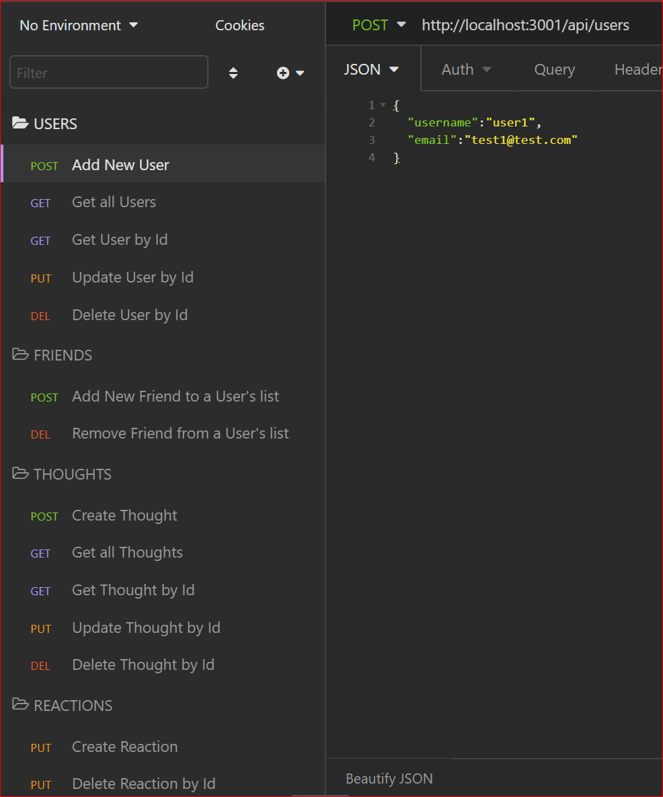

# Social Media API using NoSQL (MongoDB/Mongoose)

## Description 
Social Media API using Express.js and Mongoose ODM for MongoDB NoSQL database

## Walktrough video
[Walkthrough video](https://drive.google.com/file/d/129P4xYIfR-jTC5YNSLok_WEdSshdyaTN/view)

[Bonus](https://drive.google.com/file/d/1m1e9c-zcC_ItMkjzFDsv7sEupUk3skqX/view)

## Video Minutes

1st video
- 00:00 - start server
- 00:10 - create 4 users (user1, user2, user3, user4)
- 00:33 - validator input email
- 00:40 - get all users
- 00:49 - get user4 by id
- 00:55 - update user4's email
- 01:01 - delete user4
- 01:09 - check that user4 has been deleted
- 01:17 - add 2 friends (user2 and user3) to user1 
- 01:44 - check that the 2 friends have been added to user1's friends list and check count
- 01:55 - delete user3 from user1's friend list
- 02:08 - check that user3 has been deleted from user1's friend list
- 02:17 - create a new thought (thought 1) assigned to user1
- 02:21 - check that thought 1 has been added to user1
- 02:31 - get all thoughts
- 02:37 - create thought 2 assigned to user2
- 02:44 - get thought 1 by id
- 02:48 - update thought 1 body
- 02:58 - check that thought 1 has been updated
- 03:09 - populate thoughts for user1 and check that thought 1 has been updated
- 03:26 - delete thought 1
- 03:35 - check that thought 1 has been deleted and doesn't populate in user1's thoughts
- 03:49 - create a reaction to thought 2 that is associated to user3
- 03:58 - check that reaction has been added to thought 2
- 04:03 - delete reaction 1

BONUS : 

user2 has one thought and when the user2 gets deleted, the associated thought is also deleted


## Table of Contents

* [Walkthrough Video](#walkthrough-video)
* [Minutes](#video-minutes)
* [User Story](#user-story)
* [Installation](#installation)
* [Usage](#usage)
* [Main Endpoints](#main-endpoints)
* [Screenshot](#screenshot)
* [Technologies](#technologies)

## User Story
````
AS A social media startup
I WANT an API for my social network that uses a NoSQL database
SO THAT my website can handle large amounts of unstructured data

GIVEN a social network API
WHEN I enter the command to invoke the application
THEN my server is started and the Mongoose models are synced to the MongoDB database
WHEN I open API GET routes in Insomnia Core for users and thoughts
THEN the data for each of these routes is displayed in a formatted JSON
WHEN I test API POST, PUT, and DELETE routes in Insomnia Core
THEN I am able to successfully create, update, and delete users and thoughts in my database
WHEN I test API POST and DELETE routes in Insomnia Core
THEN I am able to successfully create and delete reactions to thoughts and add and remove friends to a user’s friend list
````

## Installation
1. Clone the repo 
```
git@github.com:luluvann/mongodb-social-network-api.git
```
2. Open a terminal and cd to the root of the cloned repo
3. Install all dependencies
````
npm install
````
4. Start the server with the following command
````
nodemon server.js
````

## Usage 
1. Open Insomnia or Postman and test the various endpoints at http://localhost:3001/
2. Robot 3T, a GUI for MongoDB database

## Main Endpoints
- http://localhost:3001/api/users
- http://localhost:3001/api/users/:userId/friends/:friendId
- http://localhost:3001/api/thoughts
- http://localhost:3001/api/thoughts/:thoughtId/reactions/add
- http://localhost:3001/api/thoughts/:thoughtId/reactions/delete

## Screenshot


## Technologies
- MongoDB (NoSQL)
- Mongoose (ODM library)
- Express.js
